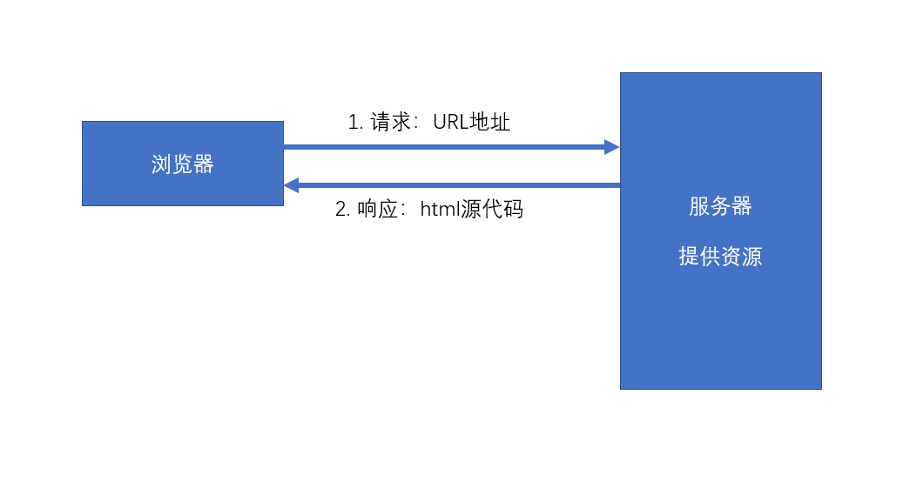

[toc]
# 起步
## React概述

> 官网：https://react.docschina.org/

### 什么是React？

React是由**Facebook**研发的、用于**解决UI复杂度**的开源**JavaScript库**，目前由React联合社区维护。

> 它不是框架，只是为了解决UI复杂度而诞生的一个库

### React的特点

- 轻量：React的开发版所有源码（包含注释）仅3000多行
- 原生：所有的React的代码都是用原生JS书写而成的，不依赖其他任何库
- 易扩展：React对代码的封装程度较低，也没有过多的使用魔法，所以React中的很多功能都可以扩展。
- 不依赖宿主环境：React只依赖原生JS语言，不依赖任何其他东西，包括运行环境。因此，它可以被轻松的移植到浏览器、桌面应用、移动端。
- 渐近式：React并非框架，对整个工程没有强制约束力。这对与那些已存在的工程，可以逐步的将其改造为React，而不需要全盘重写。
- 单向数据流：所有的数据自顶而下的流动
- 用JS代码声明界面
- 组件化
- 引入图片资源要像webpack 用import
### 对比Vue

|   对比项   |  Vue  | React |
| :--------: | :---: | :---: |
| 全球使用量 |       |   ✔   |
| 国内使用量 |   ✔   |       |
|    性能    |   ✔   |   ✔   |
|   易上手   |   ✔   |       |
|   灵活度   |       |   ✔   |
|  大型企业  |       |   ✔   |
| 中小型企业 |   ✔   |       |
|    生态    |       |   ✔   |

### 学习路径

整体原则：熟悉API --> 深入理解原理

1. React
   1. 基础：掌握React的基本使用方法，有能力制作各种组件，并理解其基本运作原理
   2. 进阶：掌握React中的一些黑科技，提高代码质量
2. React-Router：相当于vue-router
3. Redux：相当于Vuex
   1. Redux本身
   2. 各种中间件
4. 第三方脚手架：umi
5. UI库：Ant Design，相当于Vue的Element-UI 或 IView
6. 源码部分
   1. React源码分析
   2. Redux源码分析

### 关于课程

- demo关键字：课程名称前有**demo**字样的，为一个小练习，需要同学听完讲解后自行独立完成
- 扩展关键字：课程名称前有**扩展**字样的，为选修内容，没有掌握不会影响后面的学习
- 关于源代码：本门课所有源代码均使用git管理，每节课的代码为独立分支，但某些文件夹和文件不属于源代码管理范畴。
- 关于npm：本门课所有的第三方库安装，均使用yarn

## Hello World

直接在页面上使用React，引用下面的JS

```html
 <!-- React的核心库，与宿主环境无关 -->
<script crossorigin src="https://unpkg.com/react@16/umd/react.development.js"></script>
<!-- 依赖核心库，将核心的功能与页面结合 -->
<script crossorigin src="https://unpkg.com/react-dom@16/umd/react-dom.development.js"></script>
<!-- 允许跨域是为了得到详细报错信息 -->
<script src="https://unpkg.com/babel-standalone@6/babel.min.js"></script>
```

### React.createElement

创建一个React元素，称作虚拟DOM，本质上是一个对象

1. 参数1：元素类型，如果是字符串，一个普通的HTML元素
2. 参数2：元素的属性，一个对象
3. 后续参数：元素的子节点

```js
    <script crossorigin src="https://unpkg.com/react@16/umd/react.development.js"></script>
    <script crossorigin src="https://unpkg.com/react-dom@16/umd/react-dom.development.js"></script>
    <script>
        //创建一个span元素
        var span = React.createElement("span", {}, "一个span元素");
        //创建一个H1元素
        var h1 = React.createElement("h1", {
            title: "第一个React元素"
        }, "Hello", "World", span);
        ReactDOM.render(h1, document.getElementById("root"));
    </script>
```
### ReactDOM.render

react-dom的功能 负责把react元素渲染到页面上。

### JSX

JS的扩展语法，需要使用babel进行转义。

```js
    <script src="https://unpkg.com/babel-standalone@6/babel.min.js"></script>
    // 交给babel编译
    <script type="text/babel">
        //创建一个span元素
        // var span = React.createElement("span", {}, "一个span元素");
        // var span = <span>一个span元素</span>
        //创建一个H1元素
        // var h1 = React.createElement("h1", {
        //     title: "第一个React元素"
        // }, "Hello", "World", span);
        // var h1 = <h1 title="第一个React元素">Hello World <span>一个span元素</span></h1>;
        // console.log(h1);
        ReactDOM.render(<h1 title="第一个React元素">Hello World <span>一个span元素</span></h1>, document.getElementById("root"));
    </script>
```

## 使用脚手架搭建工程

官方：create-react-app
第三方：next.js、umijs

```json
"eject": "react-scripts eject" 
// 反编译 暴露webpack的配置文件
```
凡是使用JSX的文件，必须导入React 

因为JSX表达式最终要编译成React.createElement

react工程里，支持js和jsx文件,要需要配置emmet,才更友好。

## 开发环境搭建

### VSCode配置

emmet配置：

```json
"javascript": "javascriptreact"
```
js文件要需要配置emmet,才更友好。

### VSCode插件安装

- ESLint：代码风格检查
- ES7 React/Redux/GraphQL/React-Native snippets：快速代码编写

### Chrome插件安装

React Developer Tools

# React核心概念

## JSX

### 什么是JSX

- Facebook起草的JS扩展语法
- 本质是一个JS对象，会被babel编译，最终会被转换为React.createElement
- 每个JSX表达式，有且仅有一个根节点
  - React.Fragment
  - <></>
- 根节点外面最好加上（），表示这是一个表达式
- 每个JSX元素必须结束（XML规范）要么双标签 要么单标签加/

### 在JSX中嵌入表达式

- 在JSX中使用注释
- 将表达式作为内容的一部分
  - null、undefined、false不会显示
  - 普通对象，不可以作为子元素
  - 可以放置React元素对象
  - 放置数组会展开
- 将表达式作为元素属性
- 属性使用小驼峰命名法
```jsx
  const url = "https://ss1.bdstatic.com/70cFvXSh_Q1YnxGkpoWK1HF6hhy/it/u=2962719555,3613138778&fm=27&gp=0.jpg";
  const cls = "image";
  const div = (
      <div>
          
      </div>
  );
```
- 防止注入攻击(都是innerText)
  - 自动编码 
  - dangerouslySetInnerHTML
  ```jsx
    const content = "<h1>afasfasfd</h1><p>阿斯顿法定发送</p>";
    const div = (
        <div dangerouslySetInnerHTML={{
            __html: content
        }}>
        </div>
    );
  ```

### 元素的不可变性

- 虽然JSX元素是一个对象，但是该对象中的所有属性不可更改
- 如果确实需要更改元素的属性，需要重新创建JSX元素，创建对象的开销是非常小的,然后重新渲染
```jsx
  let num = 0;


  // const div = (
  //         <div title="asdfadf">
  //             {num}
  //         </div>
  //     );
  // div.props.children=2

  // 会报错 因为jsx对象用了Object.freeze,冻结了对象

  setInterval(() => {
      num++;
      const div = (
          <div title="asdfadf">
              {num}
          </div>
      );
      ReactDOM.render(div, document.getElementById("root"));
  }, 1000);
```
## 组件和组件属性

组件：包含内容、样式和功能的UI单元

### 创建一个组件

**特别注意：组件的名称首字母必须大写**
**组件的本质就是react元素，首字母小写就相当于普通的react-dom元素**

1. 函数组件
   
返回一个React元素

有两种调用方式 
- 1.函数调用 没有构建组件结构，不常用，组件渲染优化方面会出现问题
- 2.当成元素使用
```jsx
    {MyFuncComp()}
    <MyFuncComp />
```
2. 类组件

必须继承React.Component

必须提供render函数，用于渲染组件,返回一个React元素

### 组件的属性

1. 对于函数组件，属性会作为一个对象的属性，传递给函数的参数
2. 对于类组件，属性会作为一个对象的属性，传递给构造函数的参数
```js
   constructor(props) {
        super(props); // this.props = props;由于类组件继承自React.Components,需要手动调用父类的构造函数
        console.log(props, this.props, props === this.props);
    }
```

注意：组件的属性，应该使用小驼峰命名法，传递boolean属性可以省略属性值

**组件无法改变自身的属性**。

之前学习的React元素，可以对比内置组件和手写组件的props，本质上，就是一个组件（内置组件）

React中的哲学：数据属于谁，谁才有权力改动，虽然react没有深层次监控传递过来的属性，但是千万不要改动。

**React中的数据，自顶而下流动**

## 组件状态

组件状态：组件可以自行维护的数据

组件状态仅在类组件中有效

状态（state），本质上是类组件的自身一个属性，是一个对象

**状态初始化**
```js
  constructor(props) {
        super(props);
        // 初始化状态
        this.state = {
            left: this.props.number
        };        
    }
```

```js
    //初始化状态，JS Next 语法，目前处于实验阶段
    state = {
        left: this.props.number
    };
    constructor(props) {
        super(props);
        // 初始化状态         
    }        
```
**状态的变化**

不能直接改变状态：因为React无法监控到状态发生了变化

必须使用this.setState({})改变状态 

一旦调用了this.setState（Object.assign），会将给定的对象和之前的对象进行混合，会触发当前组件自动重新渲染

```js
  constructor(props) {
        super(props);
        this.state = {
            left: this.props.number
        };
        this.timer = setInterval(() => {
            this.setState({
                left: this.state.left - 1
            }); //重新设置状态，触发自动的重新渲染
            if (this.state.left === 0) {
                //停止计时器
                clearInterval(this.timer);
            }
        }, 1000);
    }
```

**组件中的数据**

1. props：该数据是由组件的使用者传递的数据，所有权不属于组件自身，因此组件无法改变该数组
2. state：该数组是由组件自身创建的，所有权属于组件自身，因此组件有权改变该数据

## 事件

在React中，组件的事件，本质上就是一个属性

按照之前React对组件的约定，由于事件本质上是一个属性，因此也需要使用小驼峰命名法

事件绑定在自定义组件上，需要手动触发，绑定在内置组件上，会在合适的时候帮你触发。

**如果没有特殊处理，在事件处理函数中，this指向undefined**

1. 使用bind函数，绑定this 
```js
     constructor(props){
         super(props);
         this.handleClick = this.handleClick.bind(this);
         this.handleOver = this.handleOver.bind(this);
     }
```
```jsx
     <Tick
        onClick={this.handleClick.bind(this)}
        onOver={this.handleOver.bind(this)}
        number={10} />
```

2. 使用箭头函数 

```js
    handleClick=()=>{
      console.log('点击了')
    }
    handleOver=()=>{
      this.setState({
        isOver:true
      })
    }
    // 这样子写完方法不在原型上而在对象上，效率最高
```
```js
      <Tick number={10} onClick={this.handleClick} 
        onOver={()=>{
          this.setState({
            isOver:true
          })
        }}/>
        // 不怎么用，代码可读性低 每次渲染都会重新申明事件函数
```

## 深入认识setState

setState，它对状态的改变，**可能**是异步的

> 如果改变状态的代码处于某个HTML元素的事件中，则其是异步的，否则是同步
```js
handleClick = () => {
        this.setState({
            n: this.state.n + 1
        });

        console.log(this.state.n); //还没有重新渲染，说明目前状态仍然没有改变
    }
```

如果遇到某个事件中，需要同步调用多次，需要使用函数的方式得到最新状态


最佳实践：

1. 把所有的setState当作是异步的
2. 永远不要信任setState调用之后的状态
3. 如果要使用改变之后的状态，需要使用回调函数（setState的第二个参数）
```js
handleClick = () => {
        this.setState({
            n: this.state.n + 1
        }, () => {
            //状态完成改变之后触发，该回调运行在render之后
            console.log(this.state.n);
        });
    }
```
4. 如果新的状态要根据之前的状态进行运算，使用函数的方式改变状态（setState的第一个参数为函数）
```js
handleClick = () => {
        this.setState(cur => {
            //参数prev表示当前的状态
            //该函数的返回结果，会混合（覆盖）掉之前的状态
            //该函数是异步执行
            return {
                n: cur.n + 1
            }
        }, ()=>{
            //所有状态全部更新完成，并且重新渲染后执行
            console.log("state更新完成", this.state.n);
        });

        this.setState(cur => ({
            n: cur.n + 1
        }));
        //这里的cur是值得信任的，是改变了之后的状态
        this.setState(cur => ({
            n: cur.n + 1
        }));
    }
```

React会对**异步的**setState进行优化，将多次setState进行合并（将多次状态改变完成后，再统一对state进行改变，然后触发render）

## 生命周期

生命周期：组件从诞生到销毁会经历一系列的过程，该过程就叫做生命周期。React在组件的生命周期中提供了一系列的钩子函数（类似于事件），可以让开发者在函数中注入代码，这些代码会在适当的时候运行。

**生命周期仅存在于类组件中，函数组件每次调用都是重新运行函数，旧的组件即刻被销毁**

### 旧版生命周期

React < 16.0.0

1. constructor 初始化阶段 初始化属性和状态
   1. 同一个组件对象只会创建一次
   2. 不能在第一次挂载到页面之前，调用setState，为了避免问题，构造函数中严禁使用setState
2. componentWillMount 组件即将挂载到页面
   1. 正常情况下，和构造函数一样，它只会运行一次
   2. 可以使用setState，但是为了避免bug，不允许使用，因为在某些特殊情况下，该函数可能被调用多次
3. **render** 组件渲染虚拟DOM
   1. 返回一个虚拟DOM，会被挂载到虚拟DOM树中，最终渲染到页面的真实DOM中
   2. render可能不只运行一次，只要需要重新渲染，就会重新运行
   3. 严禁使用setState，因为可能会导致无限递归渲染
4. **componentDidMount** 虚拟DOM已挂载到页面成为真实DOM
   1. 只会执行一次
   2. 可以使用setState
   3. 通常情况下，会将网络请求、启动计时器等一开始需要的操作，书写到该函数中
5. 组件进入活跃状态
6. componentWillReceiveProps 接收到新的属性值
   1. 即将接收新的属性值
   2. 参数为新的属性对象
   3. 该函数可能会导致一些bug，所以不推荐使用
7. **shouldComponentUpdate** 是否应该重新渲染组件，性能优化点
   1. 指示React是否要重新渲染该组件，通过返回true和false来指定
   2. 默认情况下，会直接返回true
8. componentWillUpdate 即将重新渲染组件
   1. 组件即将被重新渲染
9. componentDidUpdate 虚拟DOM已重新挂载到页面成为真实DOM
   1.  往往在该函数中使用dom操作，改变元素
10. **componentWillUnmount** 组件即将被销毁
    1.  通常在该函数中销毁一些组件依赖的资源，比如计时器

### 新版生命周期

React >= 16.0.0

React官方认为，某个数据的来源必须是单一的

1. getDerivedStateFromProps
   1. 通过参数可以获取新的属性和状态
   2. 该函数是静态的，this指向构造函数
   3. 该函数的返回值会覆盖掉组件状态
   4. 该函数几乎是没有什么用

2. getSnapshotBeforeUpdate
   1. 真实的DOM构建完成，但还未实际渲染到页面中。
   2. 在该函数中，通常用于实现一些附加的dom操作
   3. 该函数的返回值，会作为componentDidUpdate的第三个参数

## 传递元素内容

内置组件：div、h1、p

```js
// index.js
import React from 'react';
import ReactDOM from 'react-dom';
import Comp from "./Comp"

ReactDOM.render((
    <Comp content1={<h2>第2组元素内容</h2>} content2={<h2>第3组元素内容</h2>}>

        <h2>第1组元素内容</h2>

    </Comp>
), document.getElementById('root'));

```
```js
//  compont.js

    import React from 'react'

    export default function Comp(props) {
        console.log(props);
        return (
            <div className="comp">
                <h1>组件自身的内容</h1>
                {/* {props.children || <h1>默认值</h1>} */}
                {props.children}
                {props.content1}
                {props.content2}
            </div>
        )
    }
```
如果给自定义组件传递元素内容，则React会将元素内容作为children属性传递过去。

## 表单

受控组件和非受控组件

受控组件：组件的使用者，有能力完全控制该组件的行为和内容。通常情况下，受控组件往往没有自身的状态，其内容完全收到属性的控制。

非受控组件：组件的使用者，没有能力控制该组件的行为和内容，组件的行为和内容完全自行控制。

**表单组件，默认情况下是非受控组件，一旦设置了表单组件的value属性，则其变为受控组件(单选和多选框需要设置checked)**
```js
import React, { Component } from 'react'

export default class FormTest extends Component {

    state = {
        loginId: "",
        loginPwd: "",
        sex: "male",
        chooseLoves: [],
        loves: [
            { value: "football", text: "足球" },
            { value: "basetball", text: "篮球" },
            { value: "movie", text: "电影" },
            { value: "music", text: "音乐" },
            { value: "other", text: "其他" },
        ],
        city: "beijing"
    }


    handleChange=(e)=>{
        let val = e.target.value; //读取表单的值
        let name = e.target.name; //读取表单的name属性
        console.log(val,name)
        if(e.target.type==='checkbox'){
            if(this.state.chooseLoves.includes(val)){
                val=this.state.chooseLoves.filter((it)=>{
                    return it!==val
                })
            }else{
                val=[...this.state.chooseLoves,val]
            }
        }
        console.log(val,name)

        this.setState({
            [name]:val
        })
        // this.state[e.target.name]=e
    }

    getLoveCheckBoxes(){
        const checkedBox=this.state.loves.map((it)=>{
            return (<label>
                <input type="checkbox" name="chooseLoves"
                    value={it.value}
                    checked={this.state.chooseLoves.includes(it.value)}
                    onChange={this.handleChange}
                />
                {it.text}
            </label>)
        })
        return checkedBox;
    }
    render() {
        const bs = this.getLoveCheckBoxes()

        console.log(bs)
        return (
            <div>
                <p>
                    <input type="text"
                        name="loginId"
                        value={this.state.loginId}
                        onChange={this.handleChange} />
                </p>
                <p>
                    <input type="password"
                        name="loginPwd"
                        value={this.state.loginPwd}
                        onChange={this.handleChange} />
                </p>
                <p>
                    <label>
                        <input type="radio" name="sex"
                            value="male"
                            checked={this.state.sex === "male"}
                            onChange={this.handleChange}
                        />
                        男
                    </label>

                    <label>
                        <input type="radio" name="sex"
                            value="female"
                            checked={this.state.sex === "female"}
                            onChange={this.handleChange}
                        />
                        女
                    </label>
                </p>
                <p>
                    //  {bs} 
                    {this.state.loves.map((it)=>{
                        return (<label>
                            <input type="checkbox" name="chooseLoves"
                                value={it.value}
                                checked={this.state.chooseLoves.includes(it.value)}
                                onChange={this.handleChange}
                            />
                            {it.text}
                        </label>)
                    })}
                </p>
                <p>
                    <select name="city" value={this.state.city}
                        onChange={this.handleChange}
                    >
                        <option value="beijing">北京</option>
                        <option value="shanghai">上海</option>
                        <option value="chengdu">成都</option>
                    </select>
                </p>
                <p>
                    <button onClick={() => {
                        console.log(this.state)
                    }}>获取表单数据</button>
                </p>
            </div>
        )
    }
}
```
# React进阶

## 属性默认值 和 类型检查

### 属性默认值

通过一个静态属性```defaultProps```告知react属性默认值 拿到的props已经混合过了

```js
    // funcDefault
    import React from 'react'

    export default function FuncDefault(props) {
        console.log(props);//已经完成了混合
        return (
            <div>
                a:{props.a}，b:{props.b}，c:{props.c}
            </div>
        )
    }
    //属性默认值
    FuncDefault.defaultProps = {
        a: 1,
        b: 2,
        c: 3
    }
```

```JS
    static defaultProps = {
        a: 1,
        b: 2,
        c: 3
    }

```

### 属性类型检查

使用库：```prop-types```

对组件使用静态属性```propTypes```告知react如何检查属性

```js

PropTypes.any：//任意类型
PropTypes.array：//数组类型
PropTypes.bool：//布尔类型
PropTypes.func：//函数类型
PropTypes.number：//数字类型
PropTypes.object：//对象类型
PropTypes.string：//字符串类型
PropTypes.symbol：//符号类型

PropTypes.node：//任何可以被渲染的内容，字符串、数字、React元素
PropTypes.element：//react元素
PropTypes.elementType：//react元素类型
PropTypes.instanceOf(构造函数)：//必须是指定构造函数的实例
PropTypes.oneOf([xxx, xxx])：//枚举
PropTypes.oneOfType([xxx, xxx]);  //属性类型必须是数组中的其中一个
PropTypes.arrayOf(PropTypes.XXX)：//必须是某一类型组成的数组
PropTypes.objectOf(PropTypes.XXX)：//对象由某一类型的值组成
PropTypes.shape(对象): //属性必须是对象，并且满足指定的对象要求
PropTypes.exact({...})：//对象必须精确匹配传递的数据

//自定义属性检查，如果有错误，返回错误对象即可
属性: function(props, propName, componentName) {
   //...
}
```


## HOC 高阶组件

通常我们说的组件是 类组件或者函数组件，应该把元素和组件区分开来。
```<Comp />``` 
React Component Element 是类组件的实例对象或者是函数组件的调用结果
```<div />``` React Html Element 

HOF：Higher-Order Function, 高阶函数，以函数作为参数，并返回一个函数
HOC: Higher-Order Component, 高阶组件，以组件作为参数，并返回一个组件

通常，可以利用HOC实现横切关注点。

> 举例：20个组件，每个组件在创建组件和销毁组件时，需要作日志记录
> 20个组件，它们需要显示一些内容，得到的数据结构完全一致
```jsx
import React from "react"

/**
 * 高阶组件
 * @param {*} comp 组件
 */
export default function withLog(Comp, str) {
    return class LogWrapper extends React.Component {

        componentDidMount() {
            console.log(`日志：组件${Comp.name}被创建了！${Date.now()}`);
        }

        componentWillUnmount() {
            console.log(`日志：组件${Comp.name}被销毁了！${Date.now()}`);
        }


        render() {
            return (
                <>
                    <h1>{str}</h1>
                    <Comp {...this.props} />
                </>
            )
        }
    }
}
// -----
import React from 'react'

export default function withLogin(Comp) {
    return function LoginWrapper(props) {
        if (props.isLogin) {
            return <Comp {...props} />
        }
        return null;
    }
}
// -----
import React from 'react'
import { A, B } from "./components/Comps";
import withLog from "./HOC/withLog";
import withLogin from "./HOC/withLogin"
let AComp = withLogin(withLog(A, "abc"));
let BComp = withLogin(withLog(B, "Bcd"));
export default class App extends React.Component {
    render() {
        return (
            <div>
                <AComp isLogin a={1} />
                <BComp isLogin b={1} />
                <button onClick={() => {
                    this.setState({})
                }}>点击</button>
            </div>
        )
    }
}

```

**注意**

1. 不要在render或者函数组件内部中使用高阶组件,会非常浪费性能，每次重新创建组件。
2. 不要在高阶组件内部更改传入的组件


## ref

reference: 引用

场景：希望直接使用dom元素中的某个方法，或者希望直接使用自定义组件中的某个方法

1. ref作用于内置的html组件，得到的将是真实的dom对象
2. ref作用于类组件，得到的将是类的实例
3. ref不能作用于函数组件

ref不再推荐使用字符串赋值，字符串赋值的方式将来可能会被移出

目前，ref推荐使用对象或者是函数

**对象**

通过 React.createRef 函数创建

```js
import React, { Component } from 'react'

export default class Comp extends Component {

    constructor(props){
        super(props);
        this.txt = React.createRef();
    }

    handleClick = () => {
        this.txt.current.focus();
    }

    render() {
        return (
            <div>
                <input ref={this.txt} type="text" />
                <button onClick={this.handleClick}>聚焦</button>
            </div>
        )
    }
}
```

**函数**
```js
    handleClick = () => {
        // this.txt.focus();
        this.setState({
            show: !this.state.show
        });
    }
    getRef = el => {
        console.log("函数被调用了", el);
        this.txt = el;
    }

    render() {

        return (
            <div>
                {
                    this.state.show && <input ref={this.getRef} type="text" />
                }
                <button onClick={this.handleClick}>显示/隐藏</button>
            </div>
        )
    }
```
函数的调用时间：

1. componentDidMount的时候会调用该函数
   1. 在componentDidMount事件中可以使用ref
2. 如果ref的值发生了变动（旧的函数被新的函数替代），分别调用旧的函数以及新的函数，时间点出现在componentDidUpdate之前
   1. 旧的函数被调用时，传递null
   2. 新的函数被调用时，传递对象
3. 如果ref所在的组件被卸载，会调用函数

**谨慎使用ref**

能够使用属性和状态进行控制，就不要使用ref。

1. 调用真实的DOM对象中的方法
2. 某个时候需要调用类组件的方法

## Ref转发

在高阶组件中往往要用到ref转发(forwardRef),让组件内部手动控制ref要挂载的元素

forwardRef方法：

- 在函数组件中转发
1. 参数，传递的是函数组件，不能是类组件，并且，函数组件需要有第二个参数来得到ref
2. 返回值，返回一个新的组件

```js
function A(props, ref) {
    return <h1 ref={ref}>
        组件A
        <span>{props.words}</span>
    </h1>
}

//传递函数组件A，得到一个新组件NewA
const NewA = React.forwardRef(A);

export default class App extends React.Component {

    ARef = React.createRef()

    componentDidMount() {
        console.log(this.ARef);
    }


    render() {
        return (
            <div>
                <NewA ref={this.ARef} words="asfsafasfasfs" />
                {/* this.ARef.current:  h1 */}
            </div>
        )
    }
}
```
- 在类组件中转发
1. 参数，传递的是一个函数，有props和ref两个参数，
2. 返回值，返回一个新的组件，返回组件的ref必须是其他名字（如abc）否则直接使用ref会得到组件A的实例

```js
class A extends React.Component {
    render() {
        return <h1 ref={this.props.abc}>
            组件A
        <span>{this.props.words}</span>
        </h1>
    }
}

const NewA = React.forwardRef((props, ref) => {
    return <A {...props} abc={ref} />  
})

export default class App extends React.Component {

    ARef = React.createRef()

    componentDidMount() {
        console.log(this.ARef);
    }


    render() {
        return (
            <div>
                <NewA ref={this.ARef} words="asfsafasfasfs" />
                {/* this.ARef.current:  h1 */}
            </div>
        )
    }
}
```

其实用props也可以实现ref转发，但是需要改动内部组件的代码，且不能直接使用ref属性名，不容易理解。

## Context

上下文：Context，表示做某一些事情的环境

React中的上下文特点：

1. 当某个组件创建了上下文后，上下文中的数据，会被所有后代组件共享
2. 如果某个组件依赖了上下文，会导致该组件不再纯粹（外部数据仅来源于属性props）
3. 一般情况下，用于第三方组件（通用组件）

### 旧的API

**创建上下文**

只有类组件才可以创建上下文

1. 给类组件书写静态属性 childContextTypes，使用该属性对上下文中的数据类型进行约束
2. 添加实例方法 getChildContext，该方法返回的对象，即为上下文中的数据，该数据必须满足类型约束，该方法会在每次render之后运行。

**使用上下文中的数据**

要求：如果要使用上下文中的数据，组件必须有一个静态属性 contextTypes，该属性描述了需要获取的上下文中的数据类型

1. 可以在组件的构造函数中，通过第二个参数，获取上下文数据
2. **从组件的context属性中获取**
3. 在函数组件中，通过第二个参数，获取上下文数据

**上下文的数据变化**

上下文中的数据不可以直接变化，最终都是通过状态改变

在上下文中加入一个处理函数，可以用于后代组件更改上下文的数据

### 新版API

旧版API存在严重的效率问题，并且容易导致滥用

**创建上下文**

上下文是一个独立于组件的对象，该对象通过React.createContext(默认值)创建 ,不再由组件创建

返回的是一个包含两个属性的对象

1. Provider属性：生产者。一个组件，该组件会创建一个上下文，该组件有一个value属性，通过该属性，可以为其数据赋值
   1. 同一个Provider，不要用到多个组件中，如果需要在其他组件中使用该数据，应该考虑将数据提升到更高的层次
2. Consumer属性：后续讲解

**使用上下文中的数据**

1. 在类组件中，直接使用this.context获取上下文数据
   1. 要求：必须拥有静态属性 contextType , 应赋值为创建的上下文对象
2. 在类组件和函数组件,使用Consumer来获取上下文数据
   1. Consumer是一个组件
   2. 它的子节点，是一个函数（它的props.children需要传递一个函数，函数返回需要展示的组件））

```jsx
import React, { Component } from 'react'

const ctx = React.createContext();
// 在函数组件中使用上下文数据
function ChildA(props) {
    return <div>
        <h1>ChildA</h1>
        <h2>
            <ctx.Consumer>
                {value => <>{value.a}，{value.b}</>}
            </ctx.Consumer>
        </h2>
        <ChildB />
    </div>
}
// 在类组件中使用上下文数据
class ChildB extends React.Component {

    static contextType = ctx;

    render() {
        return <p>
            ChildB，来自于上下文的数据：a: {this.context.a}, b:{this.context.b}
        </p>
    }
}

export default class NewContext extends Component {

    state = {
        a: 0,
        b: "abc",
        changeA: (newA) => {
            this.setState({
                a: newA
            })
        }
    }

    render() {
        return (
            <ctx.Provider value={this.state}>
                <div>
                    <ChildA />
                </div>
            </ctx.Provider>
        )
    }
}
```

**注意细节**

如果，上下文提供者（Context.Provider）中的value属性发生变化(Object.is比较)，会导致该上下文提供的所有后代元素全部重新渲染，无论该子元素是否有优化（无论shouldComponentUpdate函数返回什么结果，不会运行shouldComponentUpdate这个函数）

```js
export default class NewContext extends Component {

    state = {
        ctx: {
            a: 0,
            b: "abc",
            changeA: (newA) => {
                this.setState({
                    a: newA
                })
            }
        }
    }

    render() {
        return (
            <ctx.Provider value={this.state.ctx}>
                <div>
                    <ChildB />

                    <button onClick={() => {
                        this.setState({})
                    }}>父组件的按钮，a加1</button>
                </div>
            </ctx.Provider>
        )
    }
}
//通过把ctx的数据作为state的一部分来实现性能优化，否则每次强制刷新，传入的都是一个新的对象，应用值不同就一定会重新渲染
```
### 上下文的应用场景

编写一套组件（有多个组件），这些组件之间有数据交互和事件触发，所以需要相互配合才能最终完成功能

比如，我们要开发一套表单组件，使用方式如下

```js

render(){
    return (
        <Form onSubmit={datas=>{
            console.log(datas); //获取表单中的所有数据（对象）
            /*
                {
                    loginId:xxxx,
                    loginPwd:xxxx
                }
            */
        }}>
            <div>
               账号： <Form.Input name="loginId" />
            </div>
            <div>
               密码： <Form.Input name="loginPwd" type="password" />
            </div>
            <div>
                <Form.Button>提交</Form.Button>
            </div>
        </Form>
    );
}

```

## PureComponent

纯组件,用于避免不必要的渲染(运行render),从而提高效率;
默认情况下,父组件的数据发生变化,会让所有子组件也重新变化.如一个任务列表又10个任务,但是添加了一个任务后,所有任务组件也会重新渲染!

优化:如果一个组件的状态和属性都没有发生变化,是没有必要重新渲染组件的 

PureComponent是一个组件,如果某个子组件继承自该组件,则该组件的shouldComponentUpdate会进行优化,对属性和状态进行浅比较,如果相等则返回false

```js
function ObjectEqual(obj1,obj2){
    for (const prop in obj1) {
        if (Object.is(obj1[prop],obj1[prop])) {
            return false;
        }
    }
    return false
}
```
**注意**
函数最好不要写在jsx语法里,因为每次重新渲染会导致,函数地址变化,导致子组件重新渲染!

1. PureComponent进行的是浅比较
    1. 为了效率,应该尽量使用PureComponent
    2. 要求不能改动之前的状态,永远是创建新的状态去覆盖之前的状态(Immutable,不可变对象),因为进行的是浅比较,引用值比较的是引用地址
    3. 专门有一个第三库Immutable.js,用来制作不可变对象
2. 函数组件用的是React.memo制作纯组件 React.memo提供的高阶函数,会返回一个纯组件
```jsx
function memo(FuncComp){
    return class Memo extends PureComponent{
        render(){
            return < FuncComp {...this.props} />
        }
    }
}
```

## render props

有时候，某些组件的各种功能及其处理逻辑几乎完全相同，只是显示的界面不一样，建议下面的方式认选其一来解决重复代码的问题（横切关注点）

1. render props
   1. 某个组件，需要某个属性
   2. 该属性是一个函数，函数的返回值用于渲染
   3. 函数的参数会传递为需要的数据
   4. 注意纯组件的属性（尽量避免每次传递的render props的地址不一致）
   5. 通常该属性的名字叫做render
2. HOC
   
```jsx
// MouseListener.js
import React, { PureComponent } from 'react'
import "./style.css"

/**
 * 该组件用于监听鼠标的变化
 */
export default class MouseListener extends PureComponent {
    state = {
        x: 0,
        y: 0
    }

    divRef = React.createRef()

    handleMouseMove = e => {
        //更新x和y的值
        const { left, top } = this.divRef.current.getBoundingClientRect();
        const x = e.clientX - left;
        const y = e.clientY - top;
        this.setState({
            x,
            y
        });
    }

    render() {
        return (
            <div ref={this.divRef} className="point" onMouseMove={this.handleMouseMove}>
                {this.props.render ? this.props.render(this.state) : "默认值"}
            </div>
        )
    }
}
// 负责渲染
import MouseListener from "./MouseListener";
import React from 'react'

const renderPoint = mouse => <>横坐标：{mouse.x}，纵坐标：{mouse.y}</>
const renderDiv = mouse => <>
    <div style={{
        width: 100,
        height: 100,
        background: "#008c8c",
        position: "absolute",
        left: mouse.x - 50,
        top: mouse.y - 50
    }}>

    </div>
</>

export default function Test() {
    return (
        <div>
            <MouseListener render={renderPoint} />
            <MouseListener render={renderDiv} />
        </div>
    )
}
```


## Portals

插槽：将一个React元素渲染到指定的DOM容器中,需要改变真实的dom结构，如蒙层，弹框

ReactDOM.createPortal(React元素, 真实的DOM容器)，该函数返回一个React元素

**注意事件冒泡**

1. React中的事件是包装过的
2. 它的事件冒泡是根据虚拟DOM树来冒泡的，与真实的DOM树无关。
```jsx
import React from 'react'
import ReactDOM from "react-dom"

function ChildA() {
    return ReactDOM.createPortal(<div className="child-a" style={{
        marginTop: 200
    }}>
        <h1>ChildA</h1>
        <ChildB />
    </div>, document.querySelector(".modal"));
}

function ChildB() {
    return <div className="child-b">
        <h1>ChildB</h1>
    </div>
}

export default function App() {
    return (
        <div className="app" onClick={e => {
            console.log("App被点击了", e.target)
        }}>
            <h1>App</h1>
            <ChildA />
        </div>
    )
}
```
## 错误边界

默认情况下，若一个组件在**渲染期间**（render）发生错误，会导致整个组件树全部被卸载

错误边界：是一个组件，该组件会捕获到渲染期间（render）子组件发生的错误，并有能力阻止错误继续传播

**让某个组件捕获错误**

1. 编写生命周期函数 getDerivedStateFromError
   1. 静态函数
   2. 运行时间点：渲染子组件的过程中，发生错误之后，在更新页面之前
   3. **注意：只有子组件发生错误，才会运行该函数**
   4. 该函数返回一个对象，React会将该对象的属性覆盖掉当前组件的state
   5. 参数：错误对象
   6. 通常，该函数用于改变状态
2. 编写生命周期函数 componentDidCatch
   1. 实例方法
   2. 运行时间点：渲染子组件的过程中，发生错误，更新页面之后，由于其运行时间点比较靠后，因此不太会在该函数中改变状态
   3. 通常，该函数用于记录错误消息
```jsx
import React, { PureComponent } from 'react'

export default class ErrorBound extends PureComponent {

    state = {
        hasError: false
    }

    static getDerivedStateFromError(error) {
        console.log("发生错误了");
        return {
            hasError: true
        }
    }

    componentDidCatch(error, info) {
        console.log("记录错误信息");
    }


    render() {
        // setTimeout(() => {
        //     throw new Error("asfasdfasf");
        // }, 1000);
        if (this.state.hasError) {
            return <h1>出现错误了！</h1>
        }
        return this.props.children
    }
}
<ErrorBound>
    <Comp1 />
</ErrorBound>
```
**错误堆栈** 从底层一层层往外抛出错误，包括内置组件和自定义组件
```
"
    in Comp2 (at App.js:11)
    in div (at App.js:5)
    in Comp1 (at App.js:43)
    in ErrorBound (at App.js:42)
    in div (at App.js:41)
    in App (at src/index.js:5)"
```

**细节**

某些错误，错误边界组件无法捕获

1. 自身的错误
2. 异步的错误 
3. 事件中的错误 
以上错误得用try/catch错误
异步和事件中 改变数据导致重新渲染时发生错误是可以捕获的。


总结：仅处理渲染子组件期间的同步错误

## React中的事件

这里的事件：React内置的DOM组件中的事件

1. 给document注册事件
2. 几乎所有的元素的事件处理，均在document的事件中处理
   1. 一些不冒泡的事件，是直接在元素上监听
   2. 一些document上面没有的事件，直接在元素上监听
3. 在document的事件处理，React会根据虚拟DOM树的完成事件函数的调用
4. React的事件参数，并非真实的DOM事件参数，是React合成的一个对象，该对象类似于真实DOM的事件参数
   1. stopPropagation，阻止事件在虚拟DOM树中冒泡
   2. nativeEvent，可以得到真实的DOM事件对象
   3. 为了提高执行效率，React使用事件对象池来处理事件对象（节约内存空间，重用之前的事件对象）


**注意事项**

1. 如果给真实的DOM注册事件，阻止了事件冒泡，则会导致react的相应事件无法触发
2. 如果给真实的DOM注册事件，事件会先于React事件运行
3. 通过React的事件中阻止事件冒泡，无法阻止真实的DOM事件冒泡
4. 可以通过nativeEvent.stopImmediatePropagation()，阻止document上剩余事件的执行
5. 在事件处理程序中，不要异步的使用事件对象，如果一定要使用，需要调用persist函数，使事件对象持久化

## 渲染原理

渲染：生成用于显示的对象，以及将这些对象形成真实的DOM对象

- React元素：React Element，通过React.createElement创建（语法糖：JSX）
  - 例如：
  - ```<div><h1>标题</h1></div>```
  - ```<App />```
- React节点：专门用于渲染到UI界面的对象，React会通过React元素，创建React节点，ReactDOM一定是通过React节点来进行渲染的
- 节点类型：
  - React DOM节点：创建该节点的React元素类型是一个字符串
  - React 组件节点：创建该节点的React元素类型是一个函数或是一个类
  - React 文本节点：由字符串、数字创建的
  - React 空节点：由null、undefined、false、true
  - React 数组节点：该节点由一个数组创建
- 真实DOM：通过document.createElement创建的dom元素


### 首次渲染(新节点渲染)

1. 通过参数的值创建节点
2. 根据不同的节点，做不同的事情
   1. 文本节点：通过document.createTextNode创建真实的文本节点
   2. 空节点：什么都不做,但是节点对象是存在的
   3. 数组节点：遍历数组，将数组每一项递归创建节点（回到第1步进行反复操作，直到遍历结束）
   4. DOM节点：通过document.createElement创建真实的DOM对象，然后立即设置该真实DOM元素的各种属性，然后遍历对应React元素的children属性，递归操作（回到第1步进行反复操作，直到遍历结束）
   5. 组件节点
      1. 函数组件：调用函数(该函数必须返回一个可以生成节点的内容)，将该函数的返回结果递归生成节点（回到第1步进行反复操作，直到遍历结束）
      2. 类组件：
         1. 创建该类的实例
         2. 立即调用对象的生命周期方法：static getDerivedStateFromProps
         3. 运行该对象的render方法，拿到节点对象（将该节点递归操作，回到第1步进行反复操作）
         4. 将该组件的componentDidMount加入到执行队列（先进先出，先进先执行），当整个虚拟DOM树全部构建完毕，并且将真实的DOM对象加入到容器中后，执行该队列
3. 生成出虚拟DOM树之后，将该树保存起来，以便后续使用
4. 将之前生成的真实的DOM对象，加入到容器中。

```js
const app = <div className="assaf">
    <h1>
        标题
        {["abc", null, <p>段落</p>]}
    </h1>
    <p>
        {undefined}
    </p>
</div>;
ReactDOM.render(app, document.getElementById('root'));
```

以上代码生成的虚拟DOM树：


```js

function Comp1(props) {
    return <h1>Comp1 {props.n}</h1>
}

function App(props) {
    return (
        <div>
            <Comp1 n={5} />
        </div>
    )
}

const app = <App />;
ReactDOM.render(app, document.getElementById('root'));
```

以上代码生成的虚拟DOM树：


```js
class Comp1 extends React.Component {
    render() {
        return (
            <h1>Comp1</h1>
        )
    }
}

class App extends React.Component {
    render() {
        return (
            <div>
                <Comp1 />
            </div>
        )
    }
}

const app = <App />;
ReactDOM.render(app, document.getElementById('root'));
```

以上代码生成的虚拟DOM树：


### 更新节点

更新的场景：

1. 重新调用ReactDOM.render，触发根节点更新
2. 在类组件的实例对象中调用setState，会导致该实例所在的节点更新

**节点的更新**

- 如果调用的是ReactDOM.render，进入根节点的**对比（diff）更新**
- 如果调用的是setState
  - 1. 运行生命周期函数，static getDerivedStateFromProps
  - 2. 运行shouldComponentUpdate，如果该函数返回false，终止当前流程 
  - 3. 运行render，得到一个新的节点，进入该新的节点的**对比更新**
  - 4. 将生命周期函数getSnapshotBeforeUpdate加入执行队列，以待将来执行
  - 5. 将生命周期函数componentDidUpdate加入执行队列，以待将来执行
 
后续步骤：(2种节点更新都要做后续步骤)
1. 更新虚拟DOM树
2. 完成真实的DOM更新
3. 依次调用执行队列中的componentDidMount
4. 依次调用执行队列中的getSnapshotBeforeUpdate
5. 依次调用执行队列中的componentDidUpdate
6. 依次调用执行队列中的componentDidUnmount
   


### 对比更新

将新产生的节点，对比之前虚拟DOM中的节点，发现差异，完成更新

问题：对比之前DOM树中哪个节点

React为了提高对比效率，做出以下假设

1. 假设节点不会出现层次的移动（对比时，直接找到旧树中对应位置的节点进行对比）
2. 不同的节点类型会生成不同的结构
   1. 相同的节点类型：节点本身类型相同，如果是由React元素生成，type值还必须一致
   2. 其他的，都属于不相同的节点类型
3. 多个兄弟通过唯一标识（key）来确定对比的新节点,如果没有key值是通过原来的index来对比

key值的作用：用于通过旧节点，寻找对应的新节点，如果某个旧节点有key值，则其更新时，会寻找相同层级中的相同key值的节点，进行对比.

**key值应该在一个范围内唯一（兄弟节点中），并且应该保持稳定**

#### 找到了对比的目标

判断节点类型是否一致


- **一致**

根据不同的节点类型，做不同的事情

**空节点**：不做任何事情

**DOM节点**：
1. 直接重用之前的真实DOM对象
2. 将其属性的变化记录下来，以待将来统一完成更新（现在不会真正的变化）
3. 遍历该新的React元素的子元素，**递归对比更新**


**文本节点**：
1. 直接重用之前的真实DOM对象
2. 将新的文本变化记录下来，将来统一完成更新

**组件节点**：

**函数组件**：重新调用函数，得到一个节点对象，进入**递归对比更新**

**类组件**：

1. 重用之前的实例
2. 调用生命周期方法getDerivedStateFromProps
3. 调用生命周期方法shouldComponentUpdate，若该方法返回false，终止
4. 运行render，得到新的节点对象，进入**递归对比更新**
5. 将该对象的getSnapshotBeforeUpdate加入队列
6. 将该对象的componentDidUpdate加入队列

**数组节点**：遍历数组进行**递归对比更新**

- **不一致**

整体上，卸载旧的节点，全新创建新的节点

**创建新节点**

进入新节点的挂载流程

**卸载旧节点**

1. **文本节点、DOM节点、数组节点、空节点、函数组件节点**：直接放弃该节点，如果节点有子节点，递归卸载节点
2. **类组件节点**：
   1. 直接放弃该节点
   2. 调用该节点的componentWillUnMount函数
   3. 递归卸载子节点


#### 没有找到对比的目标

新的DOM树中有节点被删除

新的DOM树中有节点添加

- 创建新加入的节点
- 卸载多余的旧节点


## 工具

### 严格模式

StrictMode(```React.StrictMode```)，本质是一个组件，该组件不进行UI渲染（```React.Fragment <> </>```），它的作用是，在渲染内部组件时，发现不合适的代码。

- 识别不安全的生命周期
- 关于使用过时字符串 ref API 的警告
- 关于使用废弃的 findDOMNode 方法的警告
- 检测意外的副作用
  - React要求，副作用代码仅出现在以下生命周期函数中
  - 1. ComponentDidMount
  - 2. ComponentDidUpdate
  - 3. ComponentWillUnMount

副作用：一个函数中，做了一些会影响函数外部数据的事情，例如：

1. 异步处理
2. 改变参数值
3. setState
4. 本地存储
5. 改变函数外部的变量

相反的，如果一个函数没有副作用，则可以认为该函数是一个纯函数

在严格模式下，虽然不能监控到具体的副作用代码，但它会将不能具有副作用的函数调用两遍，以便发现问题。（这种情况，仅在开发模式下有效）

- 检测过时的 context API

### Profiler

性能分析工具

分析某一次或多次提交（更新），涉及到的组件的渲染时间

火焰图：得到某一次提交，每个组件总的渲染时间以及自身的渲染时间

排序图：得到某一次提交，每个组件自身渲染时间的排序

组件图：某一个组件，在多次提交中，自身渲染花费的时间

# HOOK

## HOOK简介

HOOK是React16.8.0之后出现

组件：无状态组件（函数组件）、类组件

类组件中的麻烦：

1. this指向问题

2. 繁琐的生命周期

3. 其他问题


HOOK专门用于增强函数组件的功能（HOOK在类组件中是不能使用的），使之理论上可以成为类组件的替代品

官方强调：没有必要更改已经完成的类组件，官方目前没有计划取消类组件，只是鼓励使用函数组件

HOOK（钩子）本质上是一个函数(命名上总是以use开头)，该函数可以挂载任何功能

HOOK种类：

1. useState
2. useEffect
3. 其他...


## State Hook

State Hook是一个在函数组件中使用的函数（useState），用于在函数组件中使用状态

useState

- 函数有一个参数，这个参数的值表示状态的默认值
- 函数的返回值是一个数组，该数组一定包含两项
  - 第一项：当前状态的值
  - 第二项：改变状态的函数

一个函数组件中可以有多个状态，状态附着在对应的节点上，这种做法非常有利于横向切分关注点。

原理:状态表格保存在React节点上 
1. 改变状态，函数重新渲染，第N次调用useState
2. 检查该节点的状态表格上是否存在下标N
3. 不存在
    1. 使用默认值创建一个状态
    2. 将该状态加入状态表格,下标为N
4. 存在 
   1. 忽略掉默认值
   2. 直接得到状态值

**注意的细节**

1. 调用改变状态的函数去改变状态，函数重新渲染。
2. useState最好写到函数的起始位置，便于阅读
3. useState严禁出现在代码块（判断、循环）中
4. useState返回的函数（数组的第二项），引用不变（节约内存空间）
5. 使用函数改变数据，若数据和之前的数据完全相等（使用Object.is比较），不会导致重新渲染，以达到优化效率的目的。
6. 使用函数改变数据，传入的值不会和原来的数据进行合并，而是直接替换。
7. 如果要实现强制刷新组件
   1. 类组件：使用forceUpdate函数
   2. 函数组件：使用一个空对象的useState
```jsx
// export default class App extends Component {
//     render() {
//         return (
//             <div>
//                 <button onClick={()=>{
//                     //不会运行shouldComponentUpdate
//                     this.forceUpdate();//强制重新渲染
//                 }}>强制刷新</button>
//             </div>
//         )
//     }
// }


export default function App() {
    console.log("App Render");
    const [, forceUpdate] = useState({});
    return <div>
        <p >
            <button onClick={() => {
                forceUpdate({});
            }}>强制刷新</button>
        </p>
    </div>
}
```
7. **如果某些状态之间没有必然的联系，应该分化为不同的状态，而不要合并成一个对象**
8. 和类组件的状态一样，函数组件中改变状态可能是异步的（在DOM事件中），多个状态变化会合并以提高效率，此时，不能信任之前的状态，而应该使用回调函数的方式改变状态。如果状态变化要使用到之前的状态，尽量传递函数。

```js
// setN传一个函数 第一个参数为之前的处理结果
export default function App() {
    console.log("App render")
    const [n, setN] = useState(0); //使用一个状态，该状态的默认值是0
    return <div>
        <button onClick={() => {
            // setN(n - 1);
            // setN(n - 1);
            setN(prevN => prevN - 1); //传入的函数，在事件完成之后统一运行
            setN(prevN => prevN - 1);
        }}>-</button>
        <span>{n}</span>
        <button onClick={() => {
            // setN(n + 1) //不会立即改变，事件运行完成之后一起改变
            // setN(n + 1) //此时，n的值仍然是0

            setN(prevN => prevN + 1); //传入的函数，在事件完成之后统一运行
            setN(prevN => prevN + 1);
        }}>+</button>
    </div>
}
```

9. 如果你想要在使用setState之后，使用改变之后的值去调用一些回调函数，应该使用如下方法。

```js
export default function App() {
    console.log("App render")
    const [n, setN] = useState(0);

    useEffect(()=>{
        console.log(n)
    },[n])
    // 在改变状态后触发回调函数
    return <div>
        <button onClick={() => {
            setN(prevN => prevN - 1); //传入的函数，在事件完成之后统一运行
        }}>-</button>
        <span>{n}</span>
        <button onClick={() => {

            setN(prevN => prevN + 1); //传入的函数，在事件完成之后统一运行
        }}>+</button>
    </div>
}
```
## Effect Hook

Effect Hook：用于在函数组件中处理副作用

副作用：

1. ajax请求
2. 计时器
3. 其他异步操作
4. 更改真实DOM对象
5. 本地存储
6. 其他会对外部产生影响的操作

函数：useEffect，该函数接收一个函数作为参数，接收的函数就是需要进行副作用操作的函数


**细节**

1. 副作用函数的运行时间点，是在页面完成真实的UI渲染之后。因此它的执行是异步的，并且不会阻塞浏览器
   1. 与类组件中componentDidMount和componentDidUpdate的区别
   2. componentDidMount和componentDidUpdate，更改了真实DOM，但是用户还没有看到UI更新，同步的。
   3. useEffect中的副作用函数，更改了真实DOM，并且用户已经看到了UI更新，异步的。
   4. 组件卸载不会执行副作用函数
2. 每个函数组件中，可以多次使用useEffect，但不要放入判断或循环等代码块中,会依次执行。
3. useEffect中的副作用函数，可以有返回值，返回值必须是一个函数，该函数叫做清理函数
   1. 该函数运行时间点，在每次运行副作用函数之前
   2. 首次渲染组件不会运行
   3. 组件被销毁时一定会运行
```jsx
function stop() {
    clearInterval(window.timer); //清空之前的计时器
    window.timer = null;
}
useEffect(() => {
        //渲染完成后
        const div = ref.current;
        let curTimes = 0; //当前移动的次数
        const disX = props.left / 1000; //横坐标上每次移动的距离
        const disY = props.top / 1000; //纵坐标上每次移动的距离
        window.timer = setInterval(() => {
            curTimes++;//移动次数+1
            const newLeft = curTimes * disX;
            const newTop = curTimes * disY;
            div.style.left = newLeft + "px";
            div.style.top = newTop + "px";
            if (curTimes === 1000) {
                stop();
            }
        }, 10)
        return stop; //直接使用stop作为清理函数
    })
```
4. useEffect函数，可以传递第二个参数
   1. 第二个参数是一个数组
   2. 数组中记录该副作用的依赖数据
   3. 当组件重新渲染后，只有依赖数据与上一次不一样的时，才会执行副作用
   4. 传递空数组,就永远只会执行一次
   5. 不传递第二个参数，每次重新调用都会运行副作用函数
   6. 所以，当传递了依赖数据之后，如果数据没有发生变化
      1. 副作用函数仅在第一次渲染后运行
      2. 清理函数仅在卸载组件后运行
```js
function Test() {
  const [, forUpdate] = useState({})
  useEffect(() => {

    console.log('副作用函数')
    
    return () => {
      console.log('清理函数')
    }
  }, [])
  console.log('渲染函数')

  return <div>
     <h1>h1</h1>
     <button onClick={()=>{
       forUpdate()
     }}>重新渲染</button>
  </div>
}
function App() {
  const [visible, setVisible] = useState(true)
  return (
    <div>
      {visible &&  <Test /> }
      <button onClick={()=>{
        setVisible(false)
      }}>切换</button>
    </div>
  )
}
```
5. **副作用函数中，如果使用了函数上下文中的变量，则由于闭包的影响，会导致副作用函数中变量不会实时变化。**
```jsx
    const [n, setN] = useState(0)
    useEffect(() => {
        setTimeout(() => {
            console.log(n); //n指向，当前App函数调用时的n
        }, 5000);
    })
    return (
        <div>
            <h1>{n}</h1>
            <button onClick={() => {
                setN(n + 1);
            }}>n+1</button>
        </div>
    )
    // setN导致组件重新调用, 从而useEffect重新执行
}
```
6. 副作用函数在每次注册时，会覆盖掉之前的副作用函数，因此，尽量保持副作用函数稳定，否则控制起来会比较复杂。

## 自定义Hook

State Hook： useState
Effect Hook：useEffect

自定义Hook：将一些常用的、跨越多个组件的Hook功能，抽离出去形成一个函数，该函数就是自定义Hook，自定义Hook，由于其内部需要使用Hook功能，所以它本身也需要按照Hook的规则实现：

1. 函数名必须以use开头
2. 调用自定义Hook函数时，应该放到顶层

例如：

1. 很多组件都需要在第一次加载完成后，获取所有学生数据
```jsx
import React from 'react'
import useAllStudents from "./myHooks/useAllStudents"

function Test() {
    const stus = useAllStudents();
    const list = stus.map(it => <li key={it.id}>{it.name}</li>)
    return <ul>
        {list}
    </ul>
}

export default function App() {
    return (
        <div>
            <Test />
        </div>
    )
}
// useAllStudents
import { useEffect, useState } from "react"
import { getAllStudents } from "../services/student"

/**
 * 当组件首次加载完成后，获取所有学生数据
 */
export default function useAllStudents() {
    const [students, setStudents] = useState([])
    useEffect(() => {
        (async ()=>{
            const stus = await getAllStudents();
            setStudents(stus);
        })();
    }, [])
    return students;
}
```
2. 很多组件都需要在第一次加载完成后，启动一个计时器，然后在组件销毁时卸载

> 使用Hook的时候，如果没有严格按照Hook的规则进行，eslint的一个插件（eslint-plugin-react-hooks）会报出警告
**主要用于解决横切关注点时,使用高阶组件和renderProps时过于复杂和冗余**

## Context Hook

用于获取上下文数据,使用了Provider必须提供值,否则默认值会失效,被underfind覆盖!

```js
import React, { useContext } from 'react'

const ctx = React.createContext({
    a:10
});
// 设置默认值

// function Test() {
//     return <ctx.Consumer value={{a:20}}>
//         {value => <h1>Test，上下文的值：{value}</h1>}
//     </ctx.Consumer>
// }
// 注入值

function Test() {
    const value = useContext(ctx);
    return <h1>Test，上下文的值：{value}</h1>
}

export default function App() {
    return (
        <div>
            <ctx.Provider value="abc">
                <Test />
            </ctx.Provider>
        </div>
    )
}
```
## Callback Hook

函数名：useCallback

用于得到一个固定引用值的函数，通常用它进行性能优化

useCallback:

该函数有两个参数：

1. 函数，useCallback会固定该函数的引用，只要依赖项没有发生变化，则始终返回之前函数的地址
2. 数组，记录依赖项

该函数返回：引用相对固定的函数地址

```js
import React, { useState, useCallback } from 'react'

class Test extends React.PureComponent {

    render() {
        console.log("Test Render")
        return <div>
            <h1>{this.props.text}</h1>
            <button onClick={this.props.onClick}>改变文本</button>
        </div>
    }
}

function Parent() {
    console.log("Parent Render")
    const [txt, setTxt] = useState(1)
    const [n, setN] = useState(0)
    const handleClick = useCallback(() => {
        setTxt(txt + 1)
    }, [txt])

    return (
        <div>
            {/* 函数的地址每次渲染都发生了变化，导致了子组件跟着重新渲染，若子组件是经过优化的组件，则可能导致优化失效 */}
            //  < Test text={txt} onClick={() => {
            //     setTxt(Math.random());
            // }} />
            <Test text={txt} onClick={handleClick} />
            <input type="number"
                value={n}
                onChange={e => {
                    setN(parseInt(e.target.value))
                }}
            />
            // 函数地址改变导致组件重新渲染，如input的值改变，但是Test的状态并没有改变，所以要使用useCallback进行优化
        </div>
    )
}
```

## Memo Hook

用于保持一些比较稳定的数据（如复杂计算，生成大量React结果），通常用于性能优化 (比useCallBack应用范围更广,固定任何返回值)

> useMemo和React.memo完全没有关系
```js
function Parent() {
    console.log("Parent Render")
    const [txt, setTxt] = useState(1)
    const [n, setN] = useState(0)
    const handleClick = useMemo(() => {
        return () => {
            setTxt(txt + 1)
        };
    }, [txt])

    return (
        <div>
            {/* 函数的地址每次渲染都发生了变化，导致了子组件跟着重新渲染，若子组件是经过优化的组件，则可能导致优化失效 */}
            <Test text={txt} onClick={handleClick} />
            <input type="number"
                value={n}
                onChange={e => {
                    setN(parseInt(e.target.value))
                }}
            />
        </div>
    )
}
```

**如果React元素本身的引用没有发生变化，一定不会重新渲染**
```js
import React, { useState, useMemo } from 'react'

function Item(props) {
    // console.log("Item Render " + props.value);
    return <li>{props.value}</li>
}


export default function App() {
    const [range,] = useState({ min: 1, max: 10000 })
    const [n, setN] = useState(0)
    const list = useMemo(() => {
        const list = [];
        for (let i = range.min; i <= range.max; i++) {
            list.push(<Item key={i} value={i}></Item>)
        }
        return list;
    }, [range.min, range.max])
    // const list = [];
    // for (let i = range.min; i <= range.max; i++) {
    //     list.push(<Item key={i} value={i}></Item>)
    // }
    return (
        <div>
            <ul>
                {list}
                // <Item key={i} value={i}></Item> 这样子会不断通过React.createElement()重新创建元素

            </ul>
            <input type="number"
                value={n}
                onChange={e => {
                    setN(parseInt(e.target.value))
                }}
            />
        </div>

    )
}
```

## Ref Hook

useRef函数：
1. 一个参数：默认值
2. 返回一个固定的对象，```{current: 默认值}```
3. 固定一个唯一地址的对象（如一个React组件，同一个函数创建的不同组件的定时器）
4. 在函数组件尽量不要使用createRef(),因为每次创建一个不同ref地址

```js
import React, { useState, useRef } from 'react'
window.arr = [];

export default function App() {
    const inpRef = useRef();
    window.arr.push(inpRef);
    const [n, setN] = useState(0)
    return (
        <div>
            <input ref={inpRef} type="text" />
            <button onClick={() => {
                console.log(inpRef.current.value)
            }}>得到input的值</button>

            <input type="number"
                value={n}
                onChange={e => {
                    setN(e.target.value)
                }} />
        </div>
    )
}
```

一个React节点(组件)必须只能固定一个唯一的ref对象

```js
import React, { useState, useRef, useEffect } from 'react'
export default function App() {
    const [n, setN] = useState(10)
    const timerRef = useRef()
    useEffect(() => {
        if (n === 0) {
            return;
        }
        timerRef.current = setTimeout(() => {
            console.log(n)
            setN(n - 1)
        }, 1000)
        return () => {
            clearTimeout(timerRef.current);
        }
    }, [n])
    return (
        <div>
            <h1>{n}</h1>
        </div>
    )
}

```

# Router

## React Router 概述

React路由

### 站点


无论是使用Vue，还是React，开发的单页应用程序，可能只是该站点的一部分（某一个功能块）

一个单页应用里，可能会划分为多个页面（几乎完全不同的页面效果）（组件）

如果要在单页应用中完成组件的切换，需要实现下面两个功能：

1. 根据不同的页面地址，展示不同的组件（核心）
2. 完成无刷新的地址切换

我们把实现了以上两个功能的插件，称之为路由

### React Router

1. react-router：路由核心库，包含诸多和路由功能相关的核心代码
2. react-router-dom：利用路由核心库，结合实际的页面，实现跟页面路由密切相关的功能

如果是在页面中实现路由，需要安装react-router-dom库

## 两种模式

路由：根据不同的页面地址，展示不同的组件

url地址组成

例：https://www.react.com:443/news/1-2-1.html?a=1&b=2#abcdefg

1. 协议名(schema)：https
2. 主机名(host)：www.react.com
   1. ip地址
   2. 预设值：localhost
   3. 域名
   4. 局域网中电脑名称
3. 端口号(port)：443
   1. 如果协议是http，端口号是80，则可以省略端口号
   2. 如果协议是https，端口号是443，则可以省略端口号
4. 路径(path)：/news/1-2-1.html
5. 地址参数(search、query)：?a=1&b=2
   1. 附带的数据
   2. 格式：属性名=属性值&属性名=属性值....
6. 哈希(hash、锚点)
   1. 附带的数据

### Hash Router 哈希路由

根据url地址中的哈希值来确定显示的组件

> 原因：hash的变化，不会导致页面刷新
> 这种模式的兼容性最好

### Borswer History Router 浏览器历史记录路由

HTML5出现后，新增了History Api，从此以后，浏览器拥有了改变路径而不刷新页面的方式

History表示浏览器的历史记录，它使用栈的方式存储。


1. history.length：获取栈中数据量
2. history.pushState：向当前历史记录栈中加入一条新的记录
   1. 参数1：附加的数据，自定义的数据，可以是任何类型
   2. 参数2：页面标题，目前大部分浏览器不支持
   3. 参数3：新的地址
3. history.replaceState：将当前指针指向的历史记录，替换为某个记录
   1. 参数1：附加的数据，自定义的数据，可以是任何类型
   2. 参数2：页面标题，目前大部分浏览器不支持
   3. 参数3：新的地址

根据页面的路径决定渲染哪个组件

## 路由组件

React-Router 为我们提供了两个重要组件

### Router组件

它本身不做任何展示，仅提供路由模式配置，另外，该组件会产生一个上下文，上下文中会提供一些实用的对象和方法，供其他相关组件使用

1. HashRouter：该组件，使用hash模式匹配
2. BrowserRouter：该组件，使用BrowserHistory模式匹配

通常情况下，Router组件只有一个，将该组件包裹整个页面

### Route组件

根据不同的地址，展示不同的组件

重要属性：

1. path：匹配的路径
   1. 默认情况下，不区分大小写，可以设置sensitive属性为true，来区分大小写
   2. 默认情况下，只匹配初始目录，如果要精确匹配，配置exact属性为true
   3. 如果不写path，则会匹配任意路径
   4. strict：是否严格匹配最后一个斜杠
2. component：匹配成功后要显示的组件
3. children：
   1. 传递React元素，无论是否匹配，一定会显示children，并且会忽略component属性
   2. 传递一个函数，该函数有多个参数，这些参数来自于上下文，该函数返回react元素，则一定会显示返回的元素，并且忽略component属性

Route组件可以写到任意的地方，只要保证它是Router组件的后代元素

### Switch组件

写到Switch组件中的Route组件，当匹配到第一个Route后，会立即停止匹配

由于Switch组件会循环所有子元素，然后让每个子元素去完成匹配，若匹配到，则渲染对应的组件，然后停止循环。因此，不能在Switch的子元素中使用除Route外的其他组件。

## 路由信息

Router组件会创建一个上下文，并且，向上下文中注入一些信息

该上下文对开发者是隐藏的，Route组件若匹配到了地址，则会将这些上下文中的信息作为属性传入对应的组件

### history

它并不是window.history对象，我们利用该对象无刷新跳转地址

**为什么没有直接使用history对象**

1. React-Router中有两种模式：Hash、History，如果直接使用window.history，只能支持一种模式
2. 当使用windows.history.pushState方法时，没有办法收到任何通知，将导致React无法知晓地址发生了变化，结果导致无法重新渲染组件

- push：将某个新的地址入栈（历史记录栈）
  - 参数1：新的地址
  - 参数2：可选，附带的状态数据
- replace：将某个新的地址替换掉当前栈中的地址
- go: 与window.history一致
- forward: 与window.history一致
- back: 与window.history一致

### location

与history.location完全一致，是同一个对象，但是，与window.location不同

location对象中记录了当前地址的相关信息

我们通常使用第三方库```query-string```，用于解析地址栏中的数据

### match

该对象中保存了，路由匹配的相关信息

- isExact：事实上，当前的路径和路由配置的路径是否是精确匹配的
- params：获取路径规则中对应的数据

```jsx
<Route path="/news/:year?/:month?/:day?" component={News} />
// 参数可选
<Route path="/news/:year(\d+)/:month(\d+)/:day(\d+)/*" exact component={News} />
// *代表任意名称
```
实际上，在书写Route组件的path属性时，可以书写一个```string pattern```（字符串正则）

react-router使用了第三方库：Path-to-RegExp，该库的作用是，将一个字符串正则转换成一个真正的正则表达式。
  
**向某个页面传递数据的方式：**

1. 使用state：在push页面时，加入state
2. **利用search：把数据填写到地址栏中的？后**
3. 利用hash：把数据填写到hash后
4. **params：把数据填写到路径中**


## 非路由组件获取路由信息

某些组件，并没有直接放到Route中，而是嵌套在其他普通组件中，因此，它的props中没有路由信息，如果这些组件需要获取到路由信息，可以使用下面两种方式：

1. 将路由信息从父组件一层一层传递到子组件
2. 使用react-router提供的高阶组件withRouter，包装要使用的组件，该高阶组件会返回一个新组件，新组件将向提供的组件注入路由信息。
```jsx
import { BrowserRouter as Router, Route, Switch, withRouter } from "react-router-dom"

const AWrapper = withRouter(A);

// function withRouter(Comp) {
//     return function routerWrapper(props) {
//         //获取上下文中的信息
//         return <Comp {...props} history={上下文中的history} />
//     }
// }

function News(props) {
    return <div>
        <h1>新闻列表</h1>
        <AWrapper />
    </div>
}
```
# 其他组件

已学习：

- Router：BrowswerRouter、HashRouter
- Route
- Switch
- 高阶函数：withRouter

### Link

生成一个无刷新跳转的a元素

- to
  - 字符串：跳转的目标地址
  - 对象：
    - pathname：url路径
    - search
    - hash
    - state：附加的状态信息
- replace：bool，表示是否是替换当前地址，默认是false
- innerRef：可以将内部的a元素的ref附着在传递的对象或函数参数上
  - 函数
  - ref对象

### NavLink

是一种特殊的Link，Link组件具备的功能，它都有

它具备的额外功能是：根据当前地址和链接地址，来决定该链接的样式

- activeClassName: 匹配时使用的类名
- activeStyle: 匹配时使用的内联样式
- exact: 是否精确匹配
- sensitive：匹配时是否区分大小写
- strict：是否严格匹配最后一个斜杠

### Redirect

重定向组件，当加载到该组件时，会自动跳转（无刷新）到另外一个地址

- to：跳转的地址
  - 字符串
  - 对象
- push: 默认为false，表示跳转使用替换的方式，设置为true后，则使用push的方式跳转
- from：当匹配到from地址规则时才进行跳转
- exact: 是否精确匹配from
- sensitive：from匹配时是否区分大小写
- strict：from是否严格匹配最后一个斜杠
  
# Redux

## Redux核心概念

action  reducer  store

### MVC

它是一个UI的解决方案，用于降低UI，以及UI关联的数据的复杂度。

**传统的服务器端的MVC**



环境：

1. 服务端需要响应一个完整的HTML
2. 该HTML中包含页面需要的数据
3. 浏览器仅承担渲染页面的作用

以上的这种方式叫做**服务端渲染**，即服务器端将完整的页面组装好之后，一起发送给客户端。

服务器端需要处理UI中要用到的数据，并且要将数据嵌入到页面中，最终生成一个完整的HTML页面响应。

为了降低处理这个过程的复杂度，出现了MVC模式。


**Controller**: 处理请求，组装这次请求需要的数据
**Model**：需要用于UI渲染的数据模型
**View**：视图，用于将模型组装到界面中


**前端MVC模式的困难**

React解决了   数据 -> 视图   的问题

1. 前端的controller要比服务器复杂很多，因为前端中的controller处理的是用户的操作，而用户的操作场景是复杂的。
2. 对于那些组件化的框架（比如vue、react），它们使用的是单向数据流。若需要共享数据，则必须将数据提升到顶层组件，然后数据再一层一层传递，极其繁琐。
   1.  虽然可以使用上下文来提供共享数据，但对数据的操作难以监控，容易导致调试错误的困难，以及数据还原的困难。
   2.  并且，若开发一个大中型项目，共享的数据很多，会导致上下文中的数据变得非常复杂。

比如，上下文中有如下格式的数据：

```js
value = {
    users:[{},{},{}],
    addUser: function(u){},
    deleteUser: function(u){},
    updateUser: function(u){}
}
```


### 前端需要一个独立的数据解决方案

**Flux**

Facebook提出的数据解决方案，它的最大历史意义，在于它引入了action的概念

action是一个普通的对象，用于描述要干什么。**action是触发数据变化的唯一原因**

store表示数据仓库，用于存储共享数据。还可以根据不同的action更改仓库中的数据

示例：

```js
var loginAction = {
    type: "login",
    payload: {
        loginId:"admin",
        loginPwd:"123123"
    }
}

var deleteAction = {
    type: "delete",
    payload: 1  // 用户id为1
}
```

**Redux**

在Flux基础上，引入了reducer的概念

reducer：处理器，用于根据action来处理数据，处理后的数据会被仓库重新保存。


## 使用redux管理数据
```jsx
import { createStore } from "redux";

//假设仓库中仅存放了一个数字，该数字的变化可能是+1或-1
//约定action的格式：{type:"操作类型", payload:附加数据}

/**
 * reducer本质上就是一个普通函数
 * @param state 之前仓库中的状态（数据）
 * @param action 描述要作什么的对象
 */
function reducer(state, action) {
    //返回一个新的状态
    if (action.type === "increase") {
        return state + 1;
    }
    else if (action.type === "decrease") {
        return state - 1;
    }
    return state;//如果是一个无效的操作类型，数据不变
}

window.store = createStore(reducer, 10);

const action = {
    type: "increase"
}

console.log(window.store.getState()); //得到仓库中当前的数据

window.store.dispatch(action); //向仓库分发action

console.log(window.store.getState()); //得到仓库中当前的数据
```